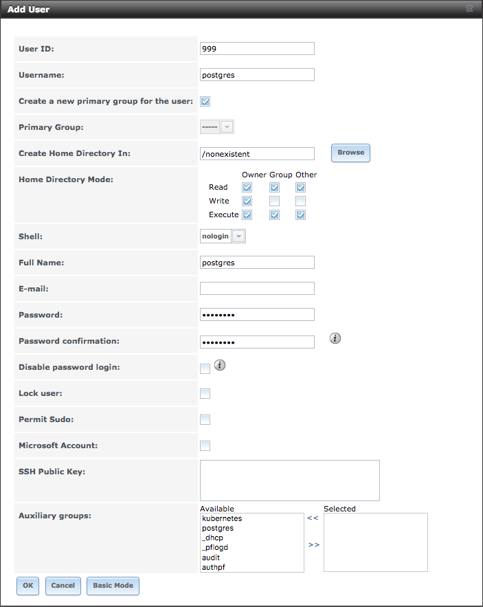
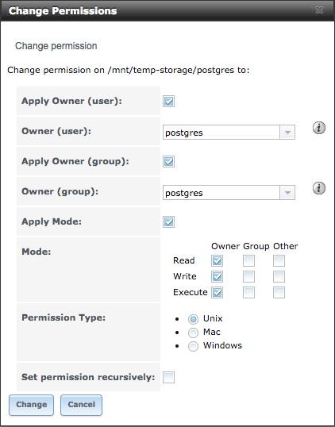
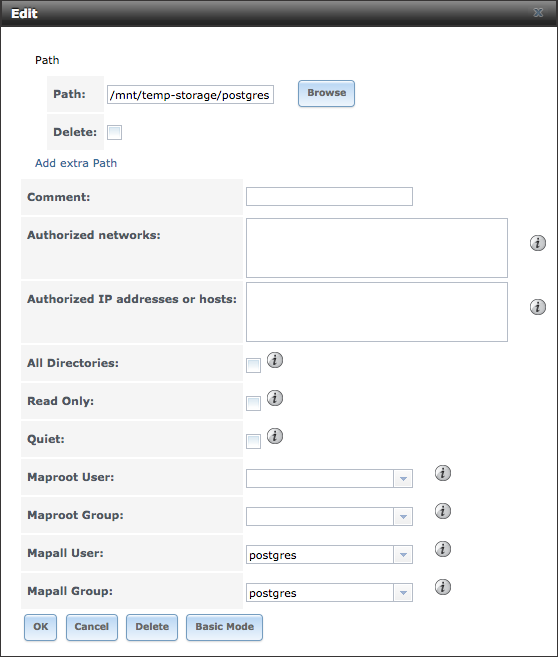

# Gitlab Server
Hey, let's run [GitLab](https://about.gitlab.com/)!

## Docker Compose
Let's start simple by firing up GitLab with [Docker Compose](https://docs.docker.com/compose/).  Let's assume that
you've already got Docker and Docker Compose installed and running.  This docker compose file will spin up Postgres,
Redis and GitLab in three separate containers and link 'em all together on a 
[bridge network](https://docs.docker.com/engine/userguide/networking/#bridge-networks) called `gitlab-server`.
You might want to take a peek at the `docker-compose.yml` file first to get a sense for what it'll be doing.

While you're in the `docker-compose.yml` file, you'll need to replace the `external_url` value in the `gitlab`
container's `environment` section with the external URL that you'll be accessing GitLab through.

Once started, the containers will attempt to persist data in a few directories under a `/srv/` directory.
You may want to create the `/srv` directory ahead of time.

To get everything up and running, simply run the docker-compose up command:

```bash
$ docker-compose up -d
```


Verify that the containers are running:

```bash
$ docker-compose ps
```

Maybe check the logs to make sure that everything has started up properly:

```bash
$ docker-compose logs
```

Shut it all down when you're done:

```bash
$ docker-compose down
```

## Kubernetes
Let's not pass Go and just jump right into running GitLab in Kubernetes, shall we?  Come on, this'll be fun!


### Stuff you'll need to do

The postgres container will run as user `postgres` with **UID** and **GID** of `999:999`.
When it spins up, it's going to attempt to take ownership (via chown) of the 
`/var/lib/postgresql/data` directory that we're mounting into the container.  Since we're
mounting an NFS share, the whole permission situation gets a little sticky.  Everyone appears 
happiest if the following accommodations are made:

* Create a `postgres` user on the NAS server with UID of **999** and a corresponding
  primary group with a GID of **999**.
* Create a shareable directory, volume or dataset that's owned by the `postgres` user
  and its corresponding group.  This is what we're going to share and it's postgres is
  going to store its data.
* Create an NFS share to share that freshly created directory, volume or dataset and map
  all incoming requests to the `postgres` user and its associated primary group.
  
Here's what this might look like if you're using [FreeNAS](http://www.freenas.org/):

#### Create a `postgres` user:


#### Create a [ZFS Dataset](https://doc.freenas.org/9.3/freenas_storage.html#create-dataset), set ownership and permissions:


#### Create an NFS share, map all users and groups to **postgres**
